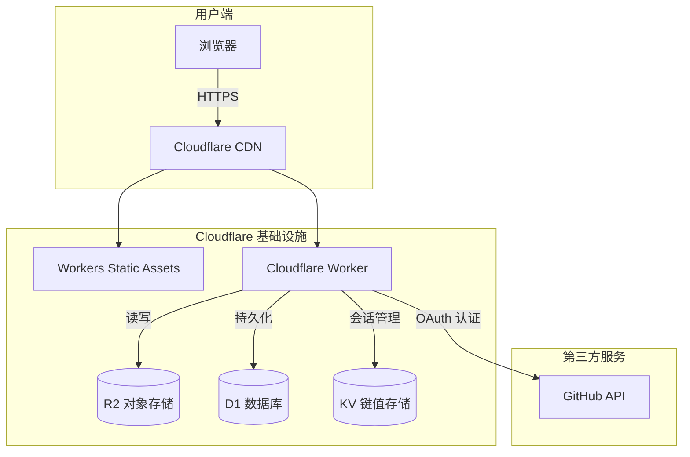
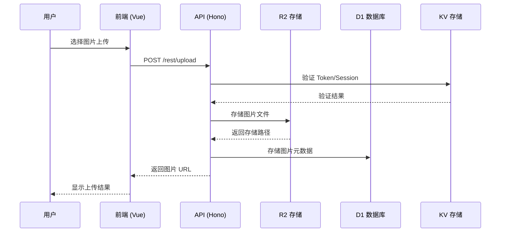

<p align="center">
  
</p>

<h1 align="center">roim-picx</h1>

<p align="center">
  <strong>🖼️ 一款基于 Cloudflare Workers、R2、D1 实现的免费图床应用</strong>
</p>

<p align="center">
  <a href="https://roim.page">🌐 在线预览</a> •
  <a href="#-功能特性">✨ 功能特性</a> •
  <a href="#-部署教程">🚀 部署教程</a> •
  <a href="#-界面截图">📸 界面截图</a>
</p>

---

## 📢 预览说明

> [!WARNING]
> 在线预览地址仅作演示使用，每天有使用限额，请勿大量上传图片。  
> **请勿将预览图床地址用于生产环境**，数据会定期清理。

**预览 Token：** `4xVSYkCKw2ExbPNEaMPjCnaaOowU9sTf`

---

## 💡 为什么选择 roim-picx？

| 特性 | 说明 |
|:---:|:---|
| 💾 **免费存储** | 10GB 的免费存储空间 |
| 🚀 **高速访问** | 每月 300W 次不计流量的图片访问（每天 10W 次限制） |
| 📤 **上传无忧** | 每月 100W 次的图片上传次数 |
| 🆓 **零成本部署** | 无需购买服务器，克隆代码后部署 Cloudflare 即可使用 |
| 🔒 **数据安全** | 独立部署，无需担心第三方删除数据 |

---

## ✨ 功能特性

- [√] 📦 图片批量上传
- [√] 📋 图片列表查询
- [√] 🗑️ 图片删除
- [√] 📁 目录创建
- [√] 🔍 按目录查询
- [√] 📎 链接地址点击复制
- [√] 🔐 简单的身份认证功能
- [√] 🔗 提供删除图片的访问链接
- [√] 📂 上传图片时支持选择目录
- [√] 📄 管理页面支持分页加载
- [√] ✏️ 图片重命名
- [√] 🔑 多平台登录授权[Github/Google/Steam]
- [√] ⏰ 文件过期自动删除
- [√] 🔎 文件前缀搜索
- [√] 👤 上传图片关联登录用户信息
- [√] 📊 访问统计与热度分析
- [√] 💾 D1 数据库持久化存储元数据
- [√] 🔄 历史 R2 数据一键同步到 D1
- [√] 📱 移动端自适应优化
- [√] 🖼️ 相册管理 (创建、编辑、公开/加密分享)
- [√] 📤 进阶上传 (保留原名、自定义过期时间)
- [√] 👀 我的分享管理 (查看状态、复制链接、删除)
- [√] 支持NSFW内容检测
- [√] Hugging Face 存储
- [√] 支持添加文本水印

---

## 🏗️ 技术架构

### 架构概览



### 前端技术栈

| 技术 | 版本 | 说明 |
|:---|:---:|:---|
| **Vue 3** | ^3.5 | 渐进式 JavaScript 框架，使用 Composition API |
| **Vue Router** | ^4.6 | 官方路由管理器 |
| **Element Plus** | ^2.13 | 基于 Vue 3 的组件库 |
| **Tailwind CSS** | ^4.1 | 原子化 CSS 框架 |
| **Vite** | ^7.3 | 下一代前端构建工具 |
| **TypeScript** | ^5.9 | JavaScript 超集，提供类型安全 |
| **Font Awesome** | ^7.1 | 图标库 |
| **Axios** | ^1.13 | HTTP 客户端 |

### 后端技术栈

| 技术 | 说明 |
|:---|:---|
| **Cloudflare Workers** | 统一承载 SPA 静态资源与 API 路由，支持全球 CDN 加速 |
| **Hono** | 轻量级、高性能的 Web 框架，运行在 Edge Runtime |
| **R2** | S3 兼容的对象存储服务，用于存储图片文件 |
| **D1** | Cloudflare 的原生 SQL 数据库，用于存储结构化元数据和统计信息 |
| **KV** | 分布式键值存储，用于会话管理和元数据存储 |

### 项目结构

```
roim-picx/
├── 📁 src/                    # 前端源码
│   ├── 📁 components/         # Vue 组件
│   ├── 📁 views/              # 页面视图
│   ├── 📁 utils/              # 工具函数
│   ├── 📁 plugins/            # 插件配置
│   └── 📄 App.vue             # 根组件
├── 📁 functions/              # Hono API 模块
│   └── 📁 rest/               # RESTful API 路由
│       └── 📄 app.ts          # Hono 应用入口
├── 📁 worker/                 # Cloudflare Worker 入口
│   └── 📄 index.ts            # Worker 主入口
├── 📁 public/                 # 静态资源
├── 📁 docs/                   # 文档资源
├── 📁 migrations/             # D1 数据库迁移文件
├── 📄 package.json            # 项目依赖配置
├── 📄 vite.config.ts          # Vite 构建配置
├── 📄 tailwind.config.js      # Tailwind CSS 配置
└── 📄 tsconfig.json           # TypeScript 配置
```

### 数据流程



---

## 🚀 部署教程

本项目现在通过 Cloudflare Workers + Workers Static Assets 部署，不再依赖 Cloudflare Pages。

### 1️⃣ 安装依赖并登录 Cloudflare

```bash
pnpm install
pnpm exec wrangler login
```

### 2️⃣ 创建 R2、KV、D1 资源

```bash
pnpm exec wrangler r2 bucket create <YOUR_BUCKET_NAME>
pnpm exec wrangler kv namespace create <YOUR_KV_NAMESPACE>
pnpm exec wrangler d1 create <YOUR_DATABASE_NAME>
```

记录以下返回值，稍后写入 `wrangler.toml`：

- KV namespace id
- D1 database id
- R2 bucket name

### 3️⃣ 配置 Worker 与资源绑定

复制 `wrangler.toml.example` 为 `wrangler.toml`，然后填写以下内容：

- `main = "worker/index.ts"`
- `[assets]`：用于托管 `dist`，并将 `/rest/*` 请求交给 Worker
- `[[kv_namespaces]]`：填写 `XK` 对应的 namespace id
- `[[r2_buckets]]`：填写 `PICX` 对应的 bucket_name
- `[[d1_databases]]`：填写 `DB` 对应的 `database_name` 和 `database_id`
- `[vars]`：填写运行时使用的非敏感变量

### 4️⃣ 配置运行时变量与 Secret

运行时变量放在 `wrangler.toml` 的 `[vars]` 中；敏感信息建议使用 Workers Secret：

```bash
pnpm exec wrangler secret put PICX_AUTH_TOKEN
pnpm exec wrangler secret put GITHUB_CLIENT_SECRET
pnpm exec wrangler secret put GOOGLE_CLIENT_SECRET
pnpm exec wrangler secret put STEAM_API_KEY
pnpm exec wrangler secret put HF_TOKEN
```

### 5️⃣ 配置 Vite 构建期变量

`VITE_*` 变量是前端构建期变量，应写入本地 `.env` 或在执行部署命令前通过 shell 注入，而不是依赖 Worker 运行时变量。

### 运行时变量（`wrangler.toml` 的 `[vars]` 或 Secret）

### 核心配置

| 变量名 | 必填 | 示例值 | 说明 |
|:---|:---:|:---|:---|
| `BASE_URL` | 是 | `https://picx.your-domain.com` | 应用根域名，用于生成完整链接与 OAuth 回调 |
| `PICX_AUTH_TOKEN` | 是 | `your-secret-token` | 管理员 Token，建议用 `wrangler secret put` 配置 |
| `ALLOW_TOKEN_LOGIN` | 否 | `true` | 是否允许使用管理 Token 直接登录后台 |
| `STORAGE_TYPE` | 否 | `R2` | 默认存储类型，可选 `R2` 或 `HF` |

### GitHub OAuth 登录（可选）

| 变量名 | 必填 | 说明 |
|:---|:---:|:---|
| `GITHUB_CLIENT_ID` | 是 | GitHub OAuth App 的 Client ID |
| `GITHUB_CLIENT_SECRET` | 是 | GitHub OAuth App 的 Client Secret，建议使用 Secret |
| `GITHUB_OWNER` | 是 | 允许登录的 GitHub 用户名，`*` 表示允许所有人 |
| `ADMIN_USERS` | 否 | 超级管理员用户名列表，逗号分隔 |

### Google 与 Steam 登录（可选）

| 变量名 | 必填 | 说明 |
|:---|:---:|:---|
| `STEAM_LOGIN_ENABLED` | 否 | 是否启用 Steam 登录 (`true`/`false`) |
| `STEAM_API_KEY` | 否 | Steam Web API Key，建议使用 Secret |
| `GOOGLE_LOGIN_ENABLED` | 否 | 是否启用 Google 登录 (`true`/`false`) |
| `GOOGLE_CLIENT_ID` | 否 | Google OAuth Client ID |
| `GOOGLE_CLIENT_SECRET` | 否 | Google OAuth Client Secret，建议使用 Secret |

### Hugging Face 存储（可选）

| 变量名 | 必填 | 说明 |
|:---|:---:|:---|
| `HF_TOKEN` | 否 | Hugging Face Access Token，建议使用 Secret |
| `HF_REPO` | 否 | Hugging Face 数据集仓库名，例如 `username/dataset` |

### 构建期变量（本地 `.env`）

| 变量名 | 必填 | 说明 |
|:---|:---:|:---|
| `VITE_GITHUB_CLIENT_ID` | 仅 GitHub 登录时必填 | 前端 GitHub OAuth Client ID |
| `VITE_APP_API_URL` | 否 | 前端 API 基地址；同域部署时可留空 |

### 6️⃣ 执行数据库迁移

```bash
pnpm exec wrangler d1 migrations apply <YOUR_DATABASE_NAME> --remote
```

### 7️⃣ 本地运行 Worker

```bash
pnpm exec wrangler dev
```

Worker 会自动构建前端静态资源，`/rest/*` 路由优先进入 Hono API，其他路径按 SPA 方式回退到 `index.html`。

### 8️⃣ 部署到 Cloudflare Workers

```bash
pnpm exec wrangler deploy
```

### 9️⃣ 绑定自定义域名（可选）

在 `wrangler.toml` 中加入以下配置即可将 Worker 直接绑定到自定义域名：

```toml
[[routes]]
pattern = "img.example.com"
custom_domain = true
```

如果你使用的是根域名或已有复杂 DNS 规则，也可以继续在 Dashboard 中管理域名绑定。

---

## 🔄 历史数据同步

如果你之前已经有一些图片存储在 R2 中但还没同步到 D1 数据库，可以使用内置的同步 API：

1. 获取你的管理员 Token (`PICX_AUTH_TOKEN`)。
2. 调用同步接口：
   ```bash
   curl -X POST -H "Authorization: <YOUR_ADMIN_TOKEN>" \
     -H "Content-Type: application/json" \
     -d '{"limit": 100}' \
     "https://your-domain.com/rest/admin/sync-r2-to-d1"
   ```
3. 如果返回数据中 `hasMore` 为 `true`，请将返回的 `nextCursor` 放入下一次调用的 `cursor` 参数中：
   ```bash
   curl -X POST -H "Authorization: <YOUR_ADMIN_TOKEN>" \
     -H "Content-Type: application/json" \
     -d '{"limit": 100, "cursor": "YOUR_NEXT_CURSOR_HERE"}' \
     "https://your-domain.com/rest/admin/sync-r2-to-d1"
   ```


---

## 📸 界面截图

<table>
  <tr>
    <td align="center">
      <br>
      <sub><b>🔐 登录页面</b></sub>
    </td>
    <td align="center">
      <br>
      <sub><b>📋 管理页面</b></sub>
    </td>
  </tr>
  <tr>
    <td align="center">
      <br>
      <sub><b>📤 上传页面</b></sub>
    </td>
    <td align="center">
      <br>
      <sub><b>📂 选择上传</b></sub>
    </td>
  </tr>
  <tr>
    <td align="center">
      <br>
      <sub><b>✅ 上传结果</b></sub>
    </td>
    <td align="center">
      <br>
      <sub><b>🗑️ 删除页面</b></sub>
    </td>
  </tr>
  <tr>
    <td align="center">
      <br>
      <sub><b>图片分享1</b></sub>
    </td>
    <td align="center">
      <br>
      <sub><b>图片分享</b></sub>
    </td>
  </tr>
  <tr>
    <td align="center">
      <br>
      <sub><b>系统管理</b></sub>
    </td>
    <td align="center">
    <br>
      <sub><b>相册管理</b></sub>
    </td>
  </tr>
</table>

---

## 🔑 GitHub 登录配置

### 步骤说明

1. **注册 GitHub 应用**  
   前往 [GitHub Developer Settings](https://github.com/settings/apps) 注册一个新的 GitHub 应用

2. **设置回调地址**  
   ```
   https://your-domain.com/auth
   ```

3. **获取客户端凭证**  
   在应用中获取客户端 ID 和客户端密钥

### 配置截图

<table>
  <tr>
    <td align="center">
      <br>
      <sub><b>找到设置</b></sub>
    </td>
    <td align="center">
      <br>
      <sub><b>进入开发者设置</b></sub>
    </td>
    <td align="center">
      <br>
      <sub><b>创建应用</b></sub>
    </td>
  </tr>
  <tr>
    <td align="center">
      <br>
      <sub><b>填写应用信息</b></sub>
    </td>
    <td align="center">
      <br>
      <sub><b>设置密钥</b></sub>
    </td>
    <td align="center">
      <br>
      <sub><b>获取密钥</b></sub>
    </td>
  </tr>
</table>

---

## 🙏 致谢

本项目参考了以下优秀开源项目：

- [cfworker-kv-image-hosting](https://github.com/realByg/cfworker-kv-image-hosting) - Cloudflare Worker KV 图床实现
- [HikariSearch](https://github.com/mixmoe/HikariSearch) - 图片搜索引擎

---

<p align="center">
  <sub>Made with ❤️ by <a href="https://github.com/roimdev">roimdev</a></sub>
</p>
